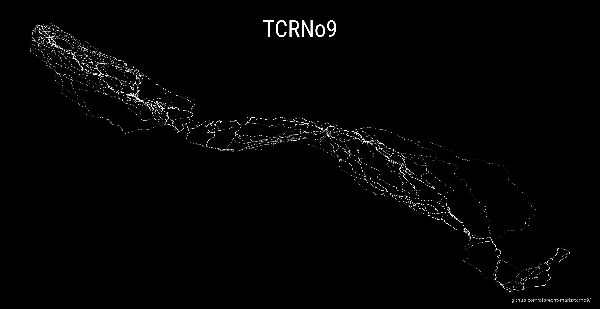

# Trancontinental Race 2023 - TCRNo9
#### Plotting the coordinates of all riders participating in the Trancontinental Race 2023


The [Transcontinental](https://www.transcontinental.cc) is a self-supported ultracycling race that spans the European continent, covering around 4000 km with a challenging 40000 m elevation gain. It's a single-stage event where time never stops, and riders must carry all their food, drinks, and equipment along the way, without the luxury of pre-arranged accommodations.

With a 16-day time limit, participants face mandatory control points and off-road parcours, but the riders have to plan their routes between the obligatory CP and sections. They try to avoid big cities, high mountains, and busy roads when planning the route, normally using [OSM](https://www.openstreetmap.org/#map=12/11.0733/106.3078)-based tools like [komoot](https://www.komoot.com).

The fact that there is no mandatory route creates an opportunity to plot all the riders' diverse paths onto a single map and see patterns!

This year's race, the TCRNo9, starts in Geraardsbergen, Belgium, and ends in Thessaloniki, Greece.
You can follow the race and fetch the data on the [Follow My Challenge](https://www2.followmychallenge.com/live/tcrno9/) website.




### Code 

```python

import json
import requests
import matplotlib.pyplot as plt
from matplotlib.font_manager import FontProperties

# TCRNo8 JS URL 
url="https://www.followmychallenge.com/live/tcrno9/data/replaydata.js"

# Fetch the route data from the URL
response = requests.get(url)
input_text = response.text

# Find the index of the substring 'var replaydata ='
start_index = input_text.find('var replaydata =')
if start_index != -1:
    # Remove everything after 'var replaydata =' including itself
    cleaned_text = input_text[:start_index]
else:
    cleaned_text = input_text
    
# Remove spaces 
cleaned_text = cleaned_text.strip()

# Remove unwanted characters and split the cleaned text into separate JSON strings
json_strings = cleaned_text.replace('\n', '').split(';')
json_strings = [s.strip() for s in json_strings if s.strip()]

# Parse each JSON object and store them in a list
data = [json.loads(obj[obj.find('{'):]) for obj in json_strings]

# Set the face color of the axes to black before creating the plot
plt.figure(figsize=(22.92, 12), facecolor='black')
ax = plt.axes(facecolor='black')

# Loop through each rider's data and plot the coordinates as lines on the map
for rider_data in data:
    # Extract the coordinates for the current rider
    coordinates = rider_data["geometry"]["coordinates"]
    lats, longs = zip(*coordinates)

    # Plot the coordinates as a line on the map with a white line
    plt.plot(lats, longs, color='white', linestyle='dashed', linewidth=0.3)

# Set the title
plt.title("TCRNo9",
          x=0.5,
          y=0.88,
          fontproperties = FontProperties(
              fname = '../assets/RobotoCondensed-Regular.ttf',
              size = 50),
          color='white')

# Hide the axes
plt.xticks(visible=False)
plt.yticks(visible=False)
plt.gca().spines['bottom'].set_visible(False)
plt.gca().spines['top'].set_visible(False)
plt.gca().spines['right'].set_visible(False)
plt.gca().spines['left'].set_visible(False)

# Save the plot as a PNG file
plt.savefig("../maps/tcrno9_route_22_12.png", dpi=300, bbox_inches='tight')

# Display plot
plt.show()

```
